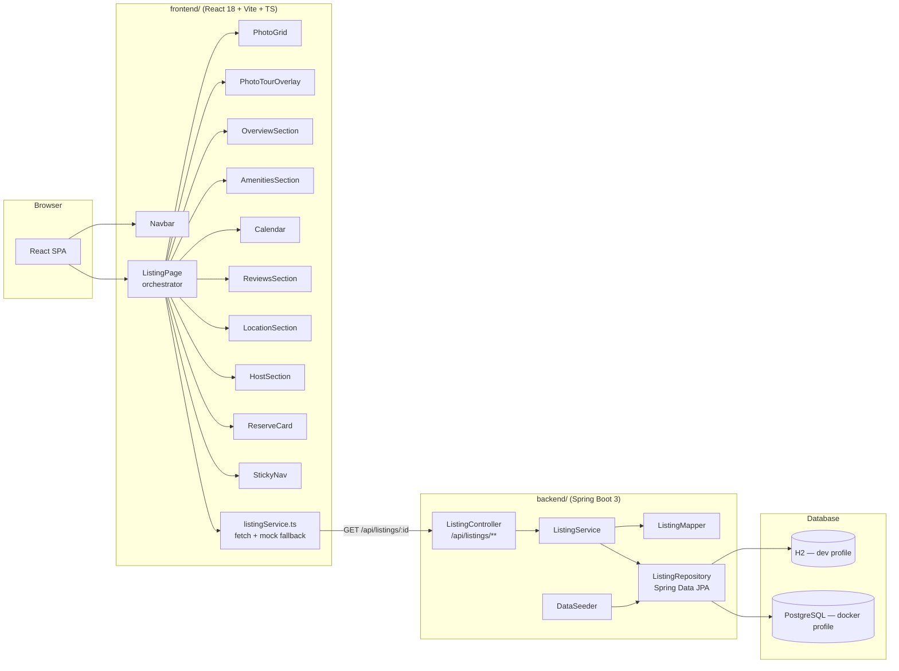

# Architecture

## Layer responsibilities

- **React frontend** — one component (+ matching CSS file) per visual section of the listing
  page (mirrors the reference site's structure 1:1), a page-level orchestrator (`ListingPage`)
  that fetches the listing once via a `useEffect` and passes it down as props, and a service
  layer that talks to the backend but degrades gracefully to an in-memory mock if the API is
  unreachable (so the UI is demoable standalone).
- **Spring Boot backend** — a thin REST layer (`ListingController`) over a JPA persistence layer.
  `Listing` is the aggregate root with child entities (`PhotoCategory`, `Review`, `Amenity`, etc.)
  mapped 1:1 to the DTOs the frontend expects, so the contract between the two is the shared
  `Listing` shape defined in `frontend/src/models/listing.ts` and
  `backend/.../dto/ListingDto.java`.
- **Database** — H2 in-memory for local dev (auto-seeded on boot via `DataSeeder`), Postgres via
  Docker Compose for a persistent, production-like run — matching Aditya's existing stack
  (Java/Spring Boot/Postgres/Docker).

## Deployment (docker-compose.yml)

`postgres` → `backend` (Spring Boot, profile `docker`) → `frontend` (Vite build served by Nginx,
proxying `/api/*` to `backend`). Three services, one `docker compose up --build`.
